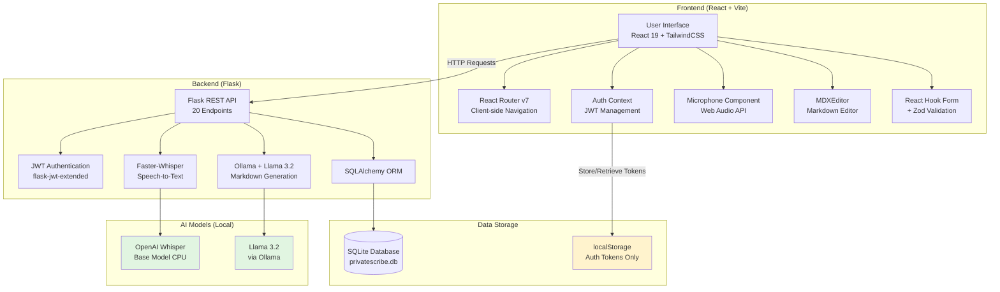
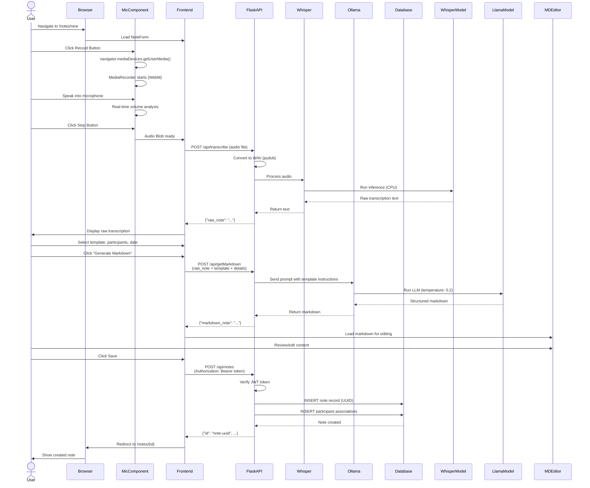
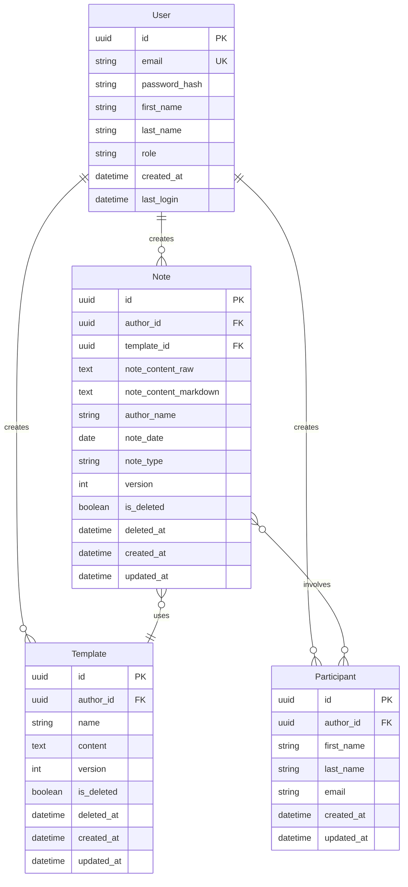
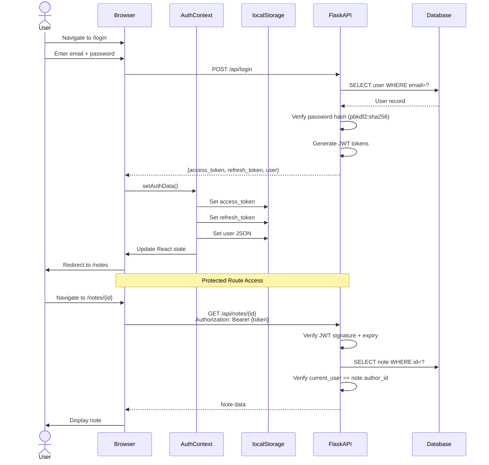
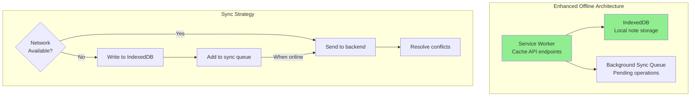

# PrivateScribe.ai - Architecture & Offline Capabilities

## Overview

**PrivateScribe.ai** is a privacy-first AI-powered note transcription application that runs entirely on your local machine. All AI processing (speech-to-text and markdown generation) happens locally, ensuring your data never leaves your computer.

---

## System Architecture



---

## Complete Data Flow: Creating a Note



---

## Database Schema



---

## Offline Capabilities Explained

### Current Implementation: LIMITED Offline Support

```mermaid
graph LR
    subgraph "Browser"
        App[React Application]
        LS[localStorage]

        App -->|Read/Write| LS
    end

    subgraph "Stored Offline"
        Token[access_token<br/>JWT 1-hour expiry]
        Refresh[refresh_token]
        UserData[user object<br/>{id, email, name}]
    end

    LS --> Token
    LS --> Refresh
    LS --> UserData

    subgraph "Network Required"
        Notes[All Note Data]
        Templates[All Template Data]
        Transcribe[Audio Transcription]
        AIGen[Markdown Generation]
        TokenValidate[Token Validation]
    end

    App -.->|Network Call| Notes
    App -.->|Network Call| Templates
    App -.->|Network Call| Transcribe
    App -.->|Network Call| AIGen
    App -.->|Network Call| TokenValidate

    style LS fill:#90EE90
    style Notes fill:#FFB6C1
    style Templates fill:#FFB6C1
    style Transcribe fill:#FFB6C1
    style AIGen fill:#FFB6C1
    style TokenValidate fill:#FFB6C1
```

### What Works Offline: ✅

1. **Authentication Persistence**
   - JWT tokens stored in `localStorage`
   - Refresh tokens for obtaining new access tokens
   - User information cached locally
   - **Result**: User stays logged in across browser sessions

### What Doesn't Work Offline: ❌

1. **No Note Caching**
   - All notes fetched from backend on each page load
   - No IndexedDB or local cache
   - **Result**: Cannot view notes without network

2. **No Service Workers**
   - No offline page caching
   - No background sync
   - **Result**: White screen if backend unreachable

3. **No Sync Queue**
   - Edits sent immediately to backend
   - No queuing for offline changes
   - **Result**: Edits fail without network

4. **AI Processing Requires Backend**
   - Whisper runs on backend server (not in browser)
   - Ollama runs on backend server
   - **Result**: Cannot transcribe or generate markdown offline

---

## Authentication Flow



---

## Technology Stack

### Frontend
| Technology | Purpose | Version |
|-----------|---------|---------|
| React | UI Framework | 19.0.0 |
| Vite | Build Tool & Dev Server | 6.1 |
| React Router | Client-side Routing | 7.2.0 |
| TailwindCSS | Styling | 4.1.7 |
| MDXEditor | Markdown Editor | 3.23.2 |
| React Hook Form | Form Management | 7.54.2 |
| Zod | Schema Validation | 3.24.2 |
| Radix UI | Headless Components | v1-v2 |

### Backend
| Technology | Purpose | Version |
|-----------|---------|---------|
| Flask | Web Framework | 3.1.0 |
| SQLAlchemy | ORM | Latest |
| flask-jwt-extended | JWT Auth | Latest |
| Faster-Whisper | Speech-to-Text | 1.1.1 |
| Ollama | LLM Inference | 0.4.7 |
| pydub | Audio Processing | Latest |

### AI Models (Local)
| Model | Purpose | Configuration |
|-------|---------|---------------|
| OpenAI Whisper | Speech Recognition | Base model, CPU |
| Llama 3.2 | Markdown Generation | Via Ollama, temp: 0.2 |

---

## API Endpoints (20 Total)

### Authentication (4)
- `POST /api/signup` - User registration
- `POST /api/login` - User login → JWT tokens
- `GET /api/validateToken` - Validate JWT
- `POST /refresh` - Refresh access token

### Notes (7)
- `POST /api/notes` - Create note
- `GET /api/notes/<id>` - Get single note
- `GET /api/notes/user/<user_id>` - Get all user notes
- `PUT /api/notes/<id>` - Update note
- `PUT /api/notes/<id>/delete` - Soft delete
- `DELETE /api/notes/<id>/delete-permanently` - Hard delete
- `PUT /api/notes/<id>/restore` - Restore deleted

### Templates (6)
- `POST /api/templates` - Create template
- `GET /api/templates/<id>` - Get template
- `GET /api/templates/user/<user_id>` - Get all templates
- `PUT /api/templates/<id>` - Update template
- `PUT /api/templates/<id>/delete` - Soft delete
- `PUT /api/templates/<id>/restore` - Restore

### Participants (2)
- `POST /api/participants` - Create participant
- `GET /api/participants/<user_id>` - Get all participants

### AI Processing (2)
- `POST /api/transcribe` - Audio → text transcription
- `POST /api/getMarkdown` - Text → structured markdown

---

## Privacy & Security

### Privacy-First Design
✅ **All AI processing happens locally**
- Whisper model runs on your CPU
- Ollama/Llama runs on your local server
- **Zero external API calls to 3rd parties**
- Your audio and notes never leave your machine

### Security Features
- **Password Hashing**: pbkdf2:sha256
- **JWT Tokens**: 1-hour expiry for access tokens
- **Authorization**: Backend verifies user owns resources
- **UUID Primary Keys**: Non-sequential IDs prevent enumeration
- **CORS**: Restricted to localhost (dev mode)

---

## How Offline Would Work (Future Enhancement)

To make this app fully offline-capable, the following would be needed:



**Required Implementations:**
1. ✅ Service Worker for caching static assets + API responses
2. ✅ IndexedDB for local note/template storage
3. ✅ Background Sync API for queuing offline changes
4. ✅ Conflict resolution (version-based or CRDTs)
5. ✅ Optimistic UI updates with rollback
6. ✅ Delta sync to minimize data transfer

---

## Performance Considerations

### AI Processing Times
- **Whisper Transcription**: ~10-30 seconds per minute of audio (CPU-bound)
- **Ollama Markdown Generation**: ~5-15 seconds (depends on prompt length)
- **Total**: ~15-45 seconds for full transcription → markdown flow

### Optimization Opportunities
- Cache transcriptions to avoid re-processing
- Implement pagination for note lists
- Add debouncing to form auto-save
- Use React.memo for expensive components
- Consider GPU acceleration for Whisper (faster-whisper supports it)

---

## Summary

**PrivateScribe.ai** is designed as a **privacy-first, locally-processed** transcription tool:

✅ **Strengths:**
- 100% local AI processing (Whisper + Ollama)
- Clean React + Flask architecture
- JWT-based authentication
- Full CRUD for notes, templates, participants
- User isolation and authorization

⚠️ **Current Offline Limitations:**
- Only auth tokens cached locally
- All data operations require network
- No service workers or background sync
- AI processing tied to backend server

The app currently operates in **online-only mode** with credential persistence. Full offline support would require service workers, IndexedDB caching, and sync queue implementation.